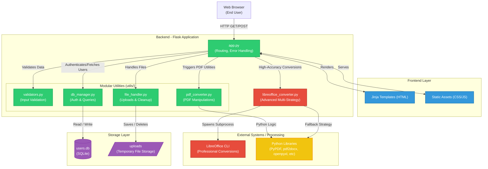

# DocuFlux System Architecture

Here is the system architecture for **DocuFlux**, depicting the structure, flow, and key modules of the system.

### Component Breakdown

1. **Frontend Layer**: Represents the statically served files and rendering engine (Jinja templates) acting as the user interface.
2. **Backend Application (`app.py`)**: The central entry point for all HTTP requests, passing validated requests to appropriate sub-modules.
3. **Utility Modules (`utils/`)**: A clean structural approach that splits business logic into:
    * `file_handler.py`: Secures user uploads and orchestrates disk cleanup to prevent bloat.
    * `validators.py`: Checks things like email format and file typing limits.
    * `db_manager.py`: Abstraction over the database commands.
    * `pdf_converter.py`: Executes PDF splits, merges, compressions, and typical structure manipulations.
4. **Advanced Conversion Engine (`libreoffice_converter.py`)**: Dedicated standalone component ensuring highly accurate fallback tools and LibreOffice usage (especially for Word-PDF pipelines).
5. **Storage Layer**: Encompasses temporary working directories (`/uploads`) and persistent relational data (`users.db`).
